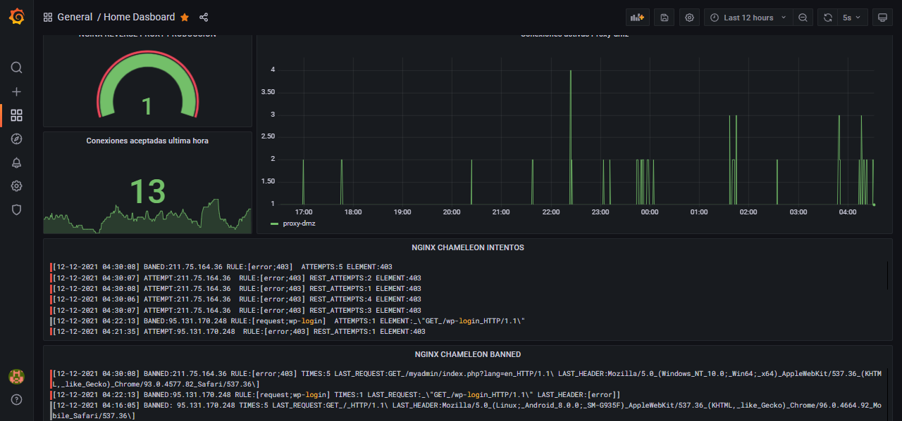

# NGINX CHAMELEON BANER


## ¿Qué es nginx chameleon baner?

Chameleon baner es un script escrito en bash que escanea el log de nginx filtrando errores, requests y headers que cumplan con las reglas establecidas por el usuario. A traves de pesos se pueden controlar los intentos de los clientes, si se incumplen los intentos definidos por el usuario se banea la ip a traves de iptables. Se pueden establecer reglas de 4 tipos:

- Request: La regla request inspecciona la request recibida e intenta machear con las reglas definidas por el usuario.

- Error: La regla error, inspecciona el codigo resultante de la peticion recibida e intenta machear con las reglas definidas por el usuario.

- Header: La regla header, inspecciona los header de la peticion en busca de palabras definidas por el usuario.

- Whitelist: Con esta regla se identifican las ips que no queremos que se baneen aunque incumplan con la politica de seguridad establecida en las reglas.

## Instalacion

1º Clonar este repositorio en la maquina donde se encuentra instalado el servidor de nginx o donde corre el contenedor docker que tiene el nginx:

- En caso de contenedor docker (por defecto): Es necesario indicar el id completo del contenedor docker donde corre nginx en las variables en fcham.sh y dejar comentada la opcion nginx_log_path debajo de #NGINX LOG [HOST MACHINE]:

```
#!/usr/bin/env bash

# VARIABLES


#NGINX LOG [HOST MACHINE]

# nginx_log_path="/var/log/nginx_access.log" # Uncoment this line if you have running your nginx in your host machine and write the correct path to the log

#DOCKER CONTAINER LOGS

nginx_container="478249807b86913e678715627e0a3f28ec6eb70975c1995e47121e4e8b5da761" 
nginx_log_path="/var/lib/docker/containers/$nginx_container/$nginx_container-json.log" # comment this line if you have runnnig your nginx on host machine
```
 - En caso de disponer del nginx instalado directamente en el host, comentar la opcion nginx_log_path debajo de #DOCKER CONTAINER LOGS y añadir el path al log de accesos de nginx: 


 ```
#!/usr/bin/env bash

# VARIABLES


#NGINX LOG [HOST MACHINE]

nginx_log_path="/var/log/nginx_access.log" # Uncoment this line if you have running your nginx in your host machine and write the correct path to the log

#DOCKER CONTAINER LOGS

nginx_container="478249807b86913e678715627e0a3f28ec6eb70975c1995e47121e4e8b5da761" 
#nginx_log_path="/var/lib/docker/containers/$nginx_container/$nginx_container-json.log" # comment this line if you have runnnig your nginx on host machine
```

2º Editar el archivo rules.csv y añadir las reglas, hay 4 tipos:

- request: Añadir en el csv como:

    `request;<palabra a detectar en la request>;<numero de intentos a permitir>`
     
     Ejemplo:
     
     `request;wp-admin;5`

- error: Añadir en el csv como:

    `error;<error a detectar>;<numero de intentos a permitir>`
     
     Ejemplo:
     
     `error;403;10`

- header: Añadir en el csv como:

    `header;<cadena a detectar en el header>;<numero de intentos a permitir>`
     
     Ejemplo:
     
     `header;python-request;0`

- whitelist: Añadir en el csv como:

    `whitelist;<IP>`
     
     Ejemplo:
     
     `whitelist;172.3.6.87`


3ª Ejecutar el instalador install.sh

```
sudo chmod u+x install.sh
./install.sh
```
Por defecto se arrancara el servicio nx_chameleon y se dejara activado para iniciar en el arranque, para pararlo, restartearlo, arrancarlo o ver el status:

```
systemctl stop nx_chameleon # Parar
systemctl start nx_chameleon # Arrancar
systemctl status nx_chameleon # Ver estado
systemctl restart nx_chameleon # Reinicia nginx chameleon baner
```

4º Añadir reglas:

Editar el archivo /etc/nginx_chameleon/rules.csv y reiniciar el servicio.

5º Logging:

Se crea una carpeta en /var/log/nginx_chameleon, dentro de dicha carpeta se encuentran todos los log tanto de uso del servicio como logs interesantes para la monitorizacion:

- cham_ban_att.log: Log donde se registran los intentos no permitidos detectados.
- cham_ban.log: En este log aparecen las ips baneadas y los motivos
- nginx.log: El log de nginx con las lineas en formato json

Ejemplo de screenshot en grafana:

 
